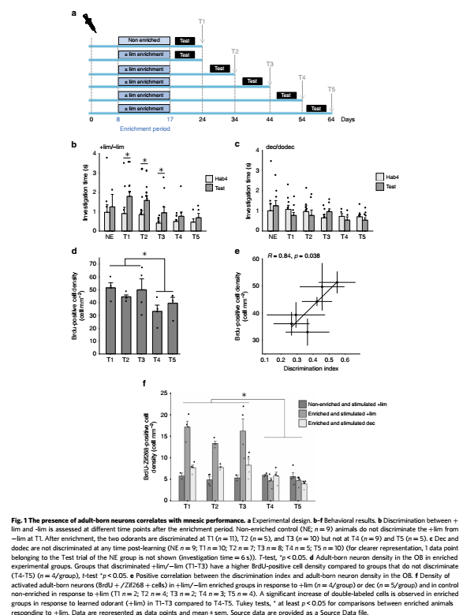
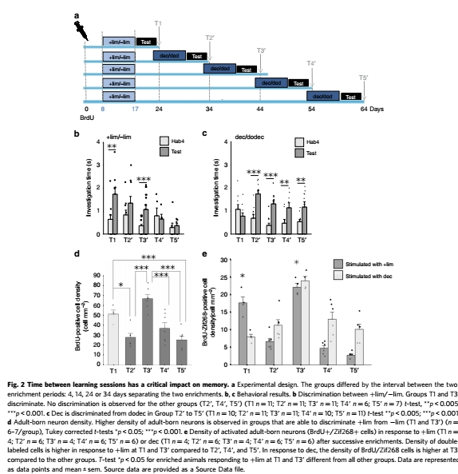
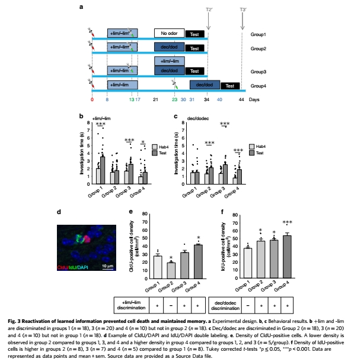
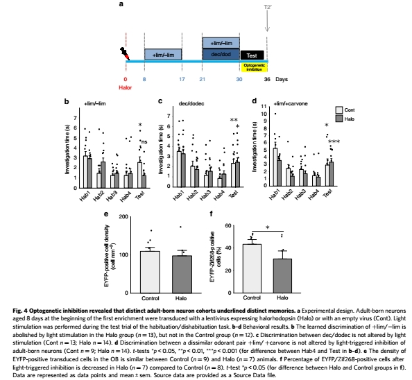

This is the second paper from my PhD work.

It's entitled 'Short-term availability of adult-born neurons for memory encoding'.
In this paper we were wondering how the olfactory bulb is able to balance the persistance versus transience of memories with the incoming stream of adult-born neurons that constantly integrate into the network. To test this we asked mice to perform two successive olfactory discrimination learning tasks with varying times between tasks.

First we showed that the presence of adult born neurons correlates with performance (using adult-born neurons labelling with Brdu). In other words performances are linjed to adult-born neurons fate.  

Next we added a second discrimination learning task and showed that time between learning session affects stored memory in a critical way.

Importantly sensory reactivatiion prevents both cells and memory loss !

Finally using optogenetics we demonstrate that distinct adult-born neurons cohorts are recruited for distinct memories.

So to answer the question of this paper we can take from these experiments that it seems that:
* cohorts of neurons of different ages, but still within their critical period, are required to allow the encoding of successive learning experiences.
* availability of adult-born neurons for encoding new experience lasts no longer than 20 days.
* performance relies on adult-born neurons recruited in the initial task suggesting that the memory is recalled rather than re-encoded.
* the state of synaptic integration of the adult-born neurons seems to make them more or less sensitive to competition from later waves of adult-born neurons.

So to sum up (and copy pasta from the paper) : Much of what we experience is ultimately forgotten, but memories for some events persist. Here, we report that modulation of the OB circuitry, as a function of the environment and  dependent on the fate of maturing adult-born neurons, is responsible for the balance between the transience or persistence of memory. This is made possible thanks to distinct neuronal populations encoding temporally distinct experiences.